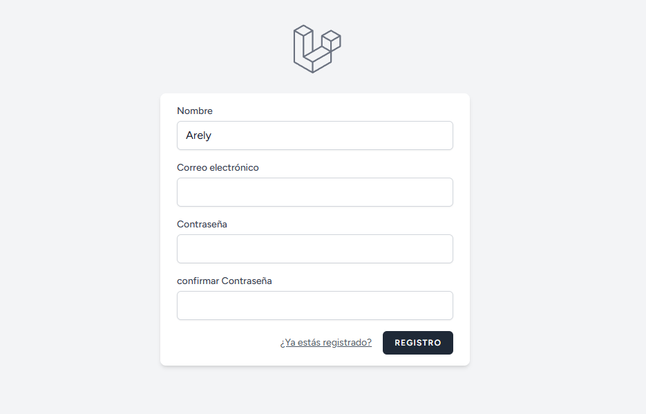
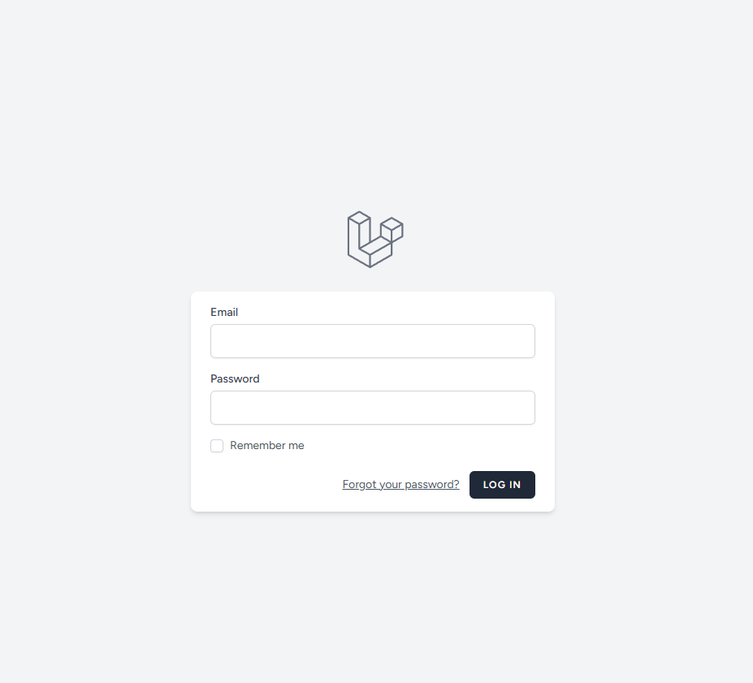

echo "# Laboratorio #2 – Implementación de Autenticación en Laravel 

**Universidad Tecnológica de Panamá** **Facultad de Ingeniería de Sistemas Computacionales** **Carrera:** Software Development and Management  
**Materia:** Desarrollo Web VII  

---

## 1. Requisitos Previos (Ecosistema de Desarrollo) 🛠️
Para la ejecución de este laboratorio, se configuró un entorno profesional que garantiza la compatibilidad del Framework con el servidor local:

* **Sistema Operativo:** Windows 10/11
* **PHP:** Versión 8.2.29 
* **Gestor de Dependencias:** Composer 2.10 (Ejecutado localmente mediante \`composer.phar\`)
* **Entorno de Desarrollo:** WampServer 
* **Base de Datos:** MariaDB (Puerto 3307) 
* **Framework:** Laravel 12 
* **Herramientas Frontend:** Node.js & NPM (Vite)

### Flujo de Instalación y Comandos:
\`\`\`bash
# Descarga manual de Composer ante ausencia de PATH global
php -r \"copy('https://getcomposer.org/composer.phar', 'composer.phar');\"

# Instalación de Breeze y Scaffolding de vistas
php composer.phar require laravel/breeze --dev
php artisan breeze:install blade

# Limpieza de base de datos y compilación de activos
php artisan migrate:fresh
npm install && npm run build
\`\`\`

---

## 2. Introducción a la Arquitectura MVC 
Laravel implementa el patrón **Modelo-Vista-Controlador**, permitiendo una separación clara de responsabilidades:

* **Modelos (\`app/Models\`):** Encargados de la lógica de datos y la interacción con la base de datos (ej. \`User.php\`).
* **Vistas (\`resources/views\`):** Interfaces de usuario desarrolladas con el motor de plantillas Blade.
* **Controladores (\`app/Http/Controllers\`):** Actúan como el cerebro que procesa las peticiones y conecta los modelos con las vistas.
* **Rutas (\`routes/web.php\`):** Definen los puntos de entrada de la aplicación y el acceso a los módulos de autenticación.

---

## 3. Resultado Final 
  
*Estado: Registro e inicio de sesión completados con éxito. Interfaz visual cargada correctamente.*

---

## 4. Gestión de Base de Datos y .env 
La persistencia de datos se gestionó mediante MariaDB. Fue fundamental la edición del archivo \`.env\` para redirigir la conexión al puerto **3307**, evitando conflictos con servicios inactivos en el puerto estándar.

* **Comando de nivelación:** Se utilizó \`php artisan migrate:fresh\` para asegurar una estructura de tablas íntegra.
* **Respaldo:** Se adjunta el archivo \`respaldo.sql\` generado vía DBeaver.

---

## 5. Dificultades y Soluciones Aplicadas 
1. **Acceso a Composer:** Se resolvió mediante el uso del binario local \`composer.phar\` invocado directamente por PHP.
2. **SQL Key Length (Error 1071):** Se corrigió mediante la configuración de \`Schema::defaultStringLength(191)\` en el archivo \`AppServiceProvider.php\`.
3. **Conflicto de Servicios:** El servidor Wamp presentaba estado naranja; se solucionó identificando el puerto activo de MariaDB y actualizando las variables de entorno de Laravel.
4. **Errores de Rutas (404):** Solventado tras la correcta instalación y publicación de los assets de Laravel Breeze.

---

## 6. Referencias 
1. [Documentación Oficial de Laravel](https://laravel.com/docs)
2. [Guía de Laravel Breeze](https://laravel.com/docs/starter-kits)
3. [Solución a errores de índices largos en SQL](https://laravel-news.com/laravel-5-4-key-too-long-error)

---

**Este laboratorio ha sido desarrollado por:** * **Nombre:** Arely Mendoza  
* **Correo:** arely.mendoza@utp.ac.pa  
* **Curso:** Desarrollo De Software
* **Instructor:** Ing. Irina Fong  
* **Fecha de Ejecución:** 16 de abril de 2026" > README.md

## Capturas de Pantalla

### Pantalla de Registro

### Pantalla de Login

